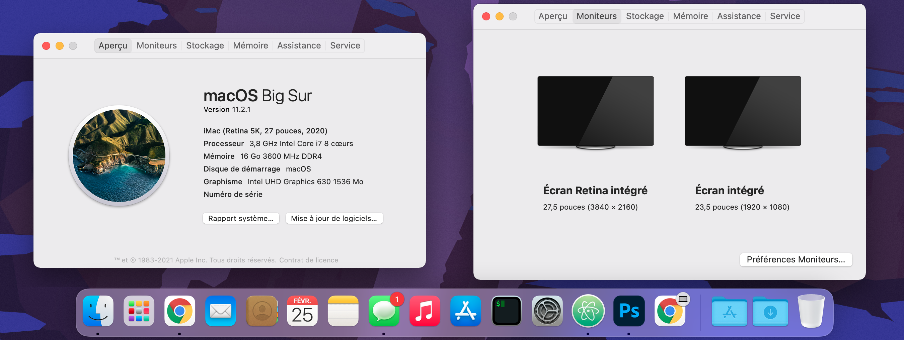

# Hackintosh-Intel-i7-10700k-Gigabyte-Z490-Vision-G

This repository contains WIP configuration files for an OpenCore build with **Gigabyte Z490 Vision G** motherboard and **Intel i7-10700k** *Comet Lake-S* desktop CPU. Compiled with OpenCore 0.6.6.

So far so good using these configuration files for **Big Sur (11.2.1)**.



Particularities of this configuration :

- I have a PCIe Wireless adapter AC1300 (**Archer T6E**). If you don't need kext for it, just remove ```Airport*.kext``` kexts. Otherwise, if you came here because you have this adapter, just copy the kexts files, and integrate them in your config file. It is that simple.
- I have an incompatible **NVIDIA GTX 1070** GPU so I disabled it to be sure there is no conflict whatsoever. To reset this, just remove ```SSDT-GPU-DISABLE.aml```.

## Hardware

- **Motherboard:** *Gigabyte Z490 Vision G*
- **Processor:** *Intel i7-10700k*
- **Memory:** *Corsair Vengeance LPX* (DDR4 - 3600 MHz)
- **dGPU:** *Nvidia GTX 1070* (Incompatible since macOS 10.14, thanks to Apple)
- **PCIe Wireless adapter:** *TP-LINK AC1300* (Archer T6E)
- **Bluetooth 4.0 USB dongle:** *Asus USB-BT400*

## Working

- **Audio:**
- **USB:**
- **Ethernet:**
- **iGPU:** DP and HDMI are working fine after patching the Framebuffer.
- **Wifi:**
- **Bluetooth:** Out of the box
- **Handoff/iMessages/Apple services:**
- **Native NVRAM:**
- **Reboot/Shutdown**

## Partially Working

- **Sleep/Wake:** Investigating...
- **DRM:** Can't play DRM content on Safari

More details to come including tools and details about configuration.

## Acknowledgments

- [Dortania](https://github.com/dortania) For the awesome OpenCore desktop guide.
- [OpenCore project](https://github.com/acidanthera/OpenCorePkg) For the cleanest and most complete bootloader of all time.
- [georgetree](https://github.com/georgetree/hackintosh-10700k-Gigabyte-Z490-Vision-g) For his work on the Z490 Vision-G framebuffer (fixing the HDMI port)
- [samuel21119](https://github.com/samuel21119/Intel-i9-10900-Gigabyte-Z490-Vision-G-Hackintosh) For his work on the USB mapping on the Vision G and on the LAN adapter

