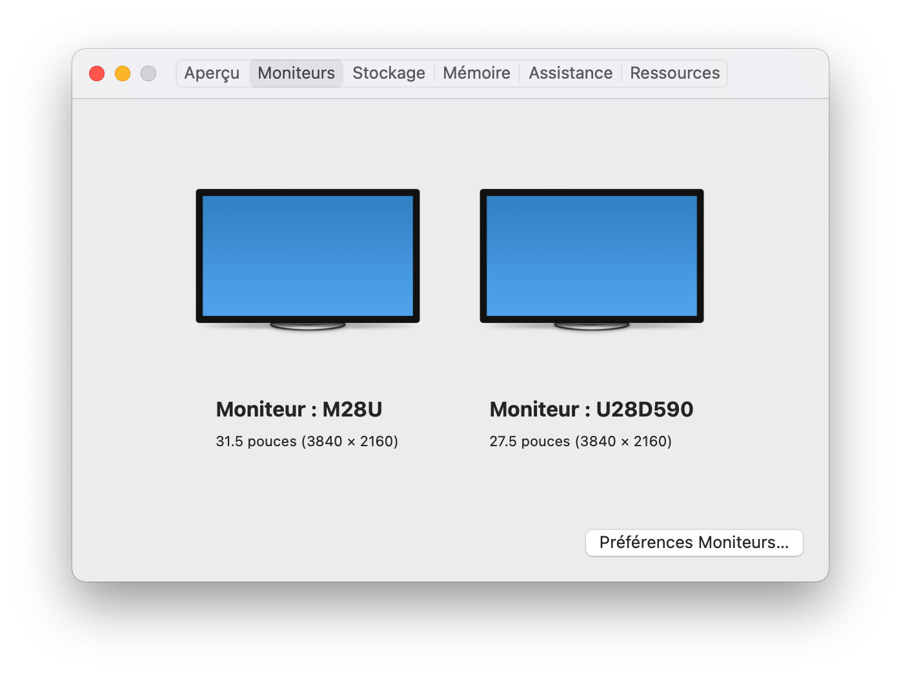
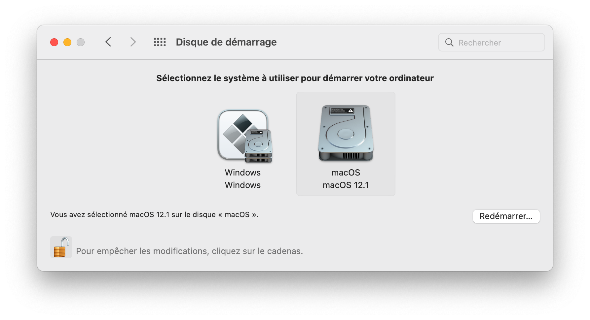
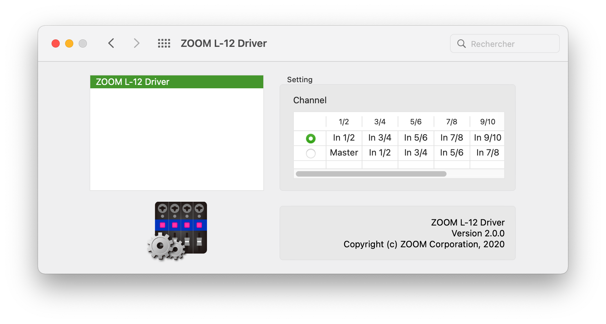
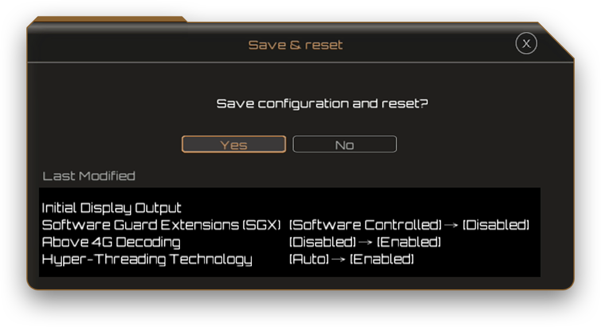
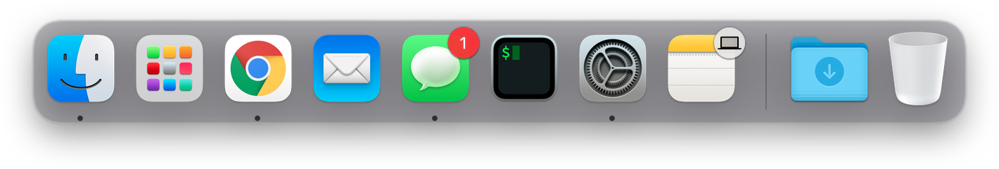

# Hackintosh-Intel-i7-10700k-Gigabyte-Z490-Vision-G

This repository contains WIP configuration files for an OpenCore build with **Gigabyte Z490 Vision G** motherboard and **Intel i7-10700k** *Comet Lake-S* desktop CPU. Compiled with **OpenCore (0.7.7)**.

Latest revision is made for macOS Monterey, based on [5T33Z0](https://github.com/5T33Z0/Gigabyte-Z490-Vision-G-Hackintosh-OpenCore) repo. I made little changes from his proposition to fix audio detection, and framebuffer patch for iGPU.

Particularities of this configuration :

- I have a PCIe Wireless adapter AC1300 (**Archer T6E**). If you don't need kext for it, just remove ```Airport*.kext``` kexts. Otherwise, if you came here because you have this adapter, just copy the kexts files, and integrate them in your config file. It is that simple.
- I have an compatible **AMD Radeon RX 6800 XT** GPU, the framebuffer patch (in DeviceProperties) is only relevant for iGPU users (I did not tested it that much on Monterey since I have a dGPU).
- **Intel I225-V Ethernet Controller** is not working on macOS Monterey. Stay on macOS Big Sur if you do not have an alternative.
- Sleep is broken for me (but it may be due to one of my USB device, I'll investiguate)

So far so good using these configuration files for **Monterey (12.2)**.

**⚠️ This README.md is only relevant for the Monterey configuration. I will not test older revisions of macOS**.

<p align="center"></p>

## Hardware

- **Motherboard:** *Gigabyte Z490 Vision G*
- **Processor:** *Intel i7-10700k*
- **Memory:** *Corsair Vengeance LPX* (DDR4 - 3600 MHz)
- **dGPU:** *AMD Radeon RX 6800 XT* (Compatible since macOS Big Sur)
- **PCIe Wireless adapter:** *TP-LINK AC1300* (Archer T6E)
- **Bluetooth 4.0 USB dongle:** *Asus USB-BT400*
- **CPU Cooler:** *Corsair iCue H100i RGB PRO XT*
- **Mixing table / External sound card:** *Zoom Livetrack L-12*

## Working

- **Audio *(Realtek ALC1220-VB / HDMI Audio)***
  Using proper Device Property, and ```AppleALC.kext```. FakeID is not required anymore (it's even broken on Monterey) :

  ```xml
  <key>PciRoot(0x0)/Pci(0x1F,0x3)</key>
  <dict>
    <key>device_type</key>
    <string>Audio device</string>
    <key>layout-id</key>
    <integer>7</integer>
    <key>model</key>
    <string>Realtek ALC1220-VB</string>
  </dict>
  ```

- **USB**
  USB Ports are mapped via ACPI (thanks to [5T33Z0](https://github.com/5T33Z0/Gigabyte-Z490-Vision-G-Hackintosh-OpenCore) again). No kext required.
  
- **Ethernet *(Intel I225-V 2.5GbE LAN)*** (Not compatible with macOS Monterey) 
  Using **[samuel21119](https://github.com/samuel21119)** custom kext ```FakePCIID_Intel_I225-V.kext```, and Device property:

  ```xml
  <key>PciRoot(0x0)/Pci(0x1C,0x1)/Pci(0x0, 0x0)</key>
  <dict>
  	<key>device-id</key>
  	<data>8hUAAA==</data>
  </dict>
  ```

- **iGPU *(Intel UHD Graphics 630)***
DP and HDMI are working fine after patching the Framebuffer. Keep in mind that this framebuffer is tested only with this Motherboard and i7-10700k Comet Lake-S Desktop processor. You'll have to change some values if you don't have exactly the same hardware. To do so I recommend you to follow the [dortania guide](https://dortania.github.io/OpenCore-Post-Install/gpu-patching/), which is surely a reference treating with Open Core bootloader. Credits to **[georgetree](https://github.com/georgetree)** for [his work on the framebuffer](https://github.com/georgetree/hackintosh-10700k-Gigabyte-Z490-Vision-g).

  ```xml
  <key>PciRoot(0x0)/Pci(0x2,0x0)</key>
  <dict>
    <key>AAPL,ig-platform-id</key>
    <data>BwCbPg==</data>
    <key>device-id</key>
    <data>xZsAAA==</data>
    <key>framebuffer-con1-busid</key>
    <data>BAAAAA==</data>
    <key>framebuffer-con1-enable</key>
    <data>AQAAAA==</data>
    <key>framebuffer-con1-flags</key>
    <data>zwMAAA==</data>
    <key>framebuffer-con1-index</key>
    <data>AwAAAA==</data>
    <key>framebuffer-con1-pipe</key>
    <data>CAAAAA==</data>
    <key>framebuffer-con1-type</key>
    <data>AAgAAA==</data>
    <key>framebuffer-con2-busid</key>
    <data>AQAAAA==</data>
    <key>framebuffer-con2-enable</key>
    <data>AQAAAA==</data>
    <key>framebuffer-con2-index</key>
    <data>AgAAAA==</data>
    <key>framebuffer-con2-type</key>
    <data>AAQAAA==</data>
    <key>framebuffer-con2-flags</key>
    <data>zwMAAA==</data>
    <key>framebuffer-con2-pipe</key>
    <data>CgAAAA==</data>
    <key>framebuffer-con0-busid</key>
    <data>BQAAAA==</data>
    <key>framebuffer-con0-enable</key>
    <data>AQAAAA==</data>
    <key>framebuffer-con0-flags</key>
    <data>zwMAAA==</data>
    <key>framebuffer-con0-index</key>
    <data>AQAAAA==</data>
    <key>framebuffer-con0-pipe</key>
    <data>CQAAAA==</data>
    <key>framebuffer-con0-type</key>
    <data>AAQAAA==</data>
    <key>framebuffer-patch-enable</key>
    <data>AQAAAA==</data>
    <key>model</key>
    <string>Intel UHD Graphics 630</string>
  </dict>
  ```

  <p align="center"></p>

- **dGPU (AMD Radeon RX 6800 XT)**
  
  Using ```Lily.kext```, ```WhateverGreen.kext``` kexts, and ```agdpmod=pikera``` boot argument.

- **Wifi *(TP-LINK AC1300 - Archer T6E)***
  Using kexts ```Airport*.kext```.
- **Bluetooth *(Asus USB-BT400)***
  Using ```BlueToolFixup.kext``` from [BrcmPatchRAM](https://github.com/acidanthera/BrcmPatchRAM).
- **Handoff/iMessages/Apple services**
  Native
- **NVRAM**
  Working natively. Change default startup disk from the macOS settings.

<p align="center"></p>

- **Reboot/Shutdown**

- **Sleep Mode**

  - Note that you need to unplug the USB cable of *Corsair iCue H100i RGB PRO XT* CPU Cooler otherwise you'll get instant wake after sleep with the following error:
    ```shell
    Wake from Normal Sleep [CDNVA] : due to XDCI CNVW PEG1 PEG2 RP04/UserActivity
    ```
    To get the log of Sleep/Wake events type this in a terminal:
    ```shell
    pmset -g log | grep -e "Sleep.*due to" -e "Wake.*due to"
    ```
    The USB cable of the CPU Cooler is only needed if you want to tune the fan speed and the colors with the software iCue. So this is not so much of a deal. I didn't found any hacks to get this working with the USB link.

  - Even after doing this I get an instant wake and sleep loop:
    ```shell
    DarkWake from Normal Sleep [CDN] : due to XDCI CNVW PEG2 PEG3 RP04/ Using AC
    ```
    If you have any suggestion,  please let me know !

- **External sound card *(Zoom Livetrack L-12)***
  Using [macOS driver](https://zoomcorp.com/en/us/digital-mixer-multi-track-recorders/digital-mixer-recorder/livetrak-l-12/l-12-support/) for Zoom livetrack L-12 in order to use multitrack recording, and USB transfers between macOS and the device. Don't forget to set the switch to *Class Compilant mode* at the back of the device.

<p align="center"></p>

## Not Working

- **DRM:** Can't play DRM content on Safari, but who cares?
- **Intel I225-V Ethernet Controller** is not working on macOS Monterey. Stay on macOS Big Sur if you do not have an alternative. 
- **Sleep** (I didn't found yet how to fix it).

## BIOS Settings

**BIOS version: *F20d***

- **Disable**
  - Fast Boot
  - Intel SGX
  - CFG Lock
  - CSM Support
- **Enable**
  - Hyper-Threading
  - VT-d
  - Above 4G Decoding
  - DVMT Pre-Allocated: 64M *(Default)*
  - DVMT Total Gfx Mem: MAX

After loading optimized default settings for BIOS version >= F8b, you'll just need to change the following settings:

<p align="center"></p>

Don't forget to set up your XMP profile correctly in *Tweaker* if you have high frequency memory like mine (3600 MHz).

**I don't recommand F20b BIOS update because it breaks sleep mode and I also found it slower than F8 at startup. I am not sure why, so unless you have a 11th gen Intel processor, you can just stay at F8c (at least before Gigabyte make another update after F20b). F8c enables Resizable Base-Adress (BAR) so you good to go with it at least.**

If using iGPU, since **Gigabyte F8 BIOS Update**, in order to set ```Initial Display Output``` to ```IGFX``` you need to enable ```CSM Support```. Just enable ```CSM Support```, set ```Initial Display Output``` to ```IGFX```, then disable ```CSM Support``` (thanks [azhinu](https://github.com/azhinu) for the little [trick](https://github.com/augstb/Hackintosh-Intel-i7-10700k-Gigabyte-Z490-Vision-G/issues/1)).

## Acknowledgments

- [5T33Z0](https://github.com/5T33Z0/Gigabyte-Z490-Vision-G-Hackintosh-OpenCore) for his awesome guide and base files for Z490 Vision G motherboard.
- [Dortania](https://github.com/dortania) for the awesome OpenCore desktop guide.
- [OpenCore project](https://github.com/acidanthera/OpenCorePkg) for the cleanest and most complete bootloader of all time.
- [georgetree](https://github.com/georgetree/hackintosh-10700k-Gigabyte-Z490-Vision-g) for his work on the Z490 Vision G framebuffer (fixing the HDMI port)
- [samuel21119](https://github.com/samuel21119/Intel-i9-10900-Gigabyte-Z490-Vision-G-Hackintosh) for his work on the USB mapping on the Vision G and on the LAN adapter

<p align="center"></p>
