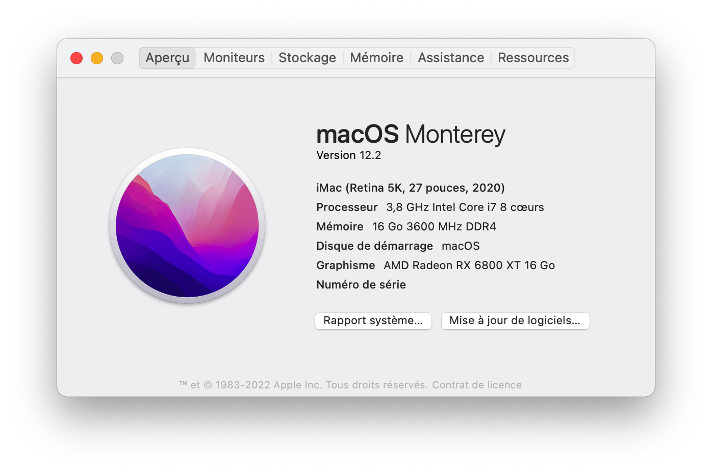

# Hackintosh-Intel-i7-10700k-Gigabyte-Z490-Vision-G

This repository contains WIP configuration files for an OpenCore build with **Gigabyte Z490 Vision G** motherboard and **Intel i7-10700k** *Comet Lake-S* desktop CPU. Compiled with OpenCore 0.6.6.

So far so good using these configuration files for **Big Sur (11.2.1)**.

<center></center>

<center></center>

Particularities of this configuration :

- I have a PCIe Wireless adapter AC1300 (**Archer T6E**). If you don't need kext for it, just remove ```Airport*.kext``` kexts. Otherwise, if you came here because you have this adapter, just copy the kexts files, and integrate them in your config file. It is that simple.
- I have an incompatible **NVIDIA GTX 1070** GPU so I disabled it to be sure there is no conflict whatsoever. To reset this, just remove ```SSDT-GPU-DISABLE.aml```.

## Hardware

- **Motherboard:** *Gigabyte Z490 Vision G*
- **Processor:** *Intel i7-10700k*
- **Memory:** *Corsair Vengeance LPX* (DDR4 - 3600 MHz)
- **dGPU:** *Nvidia GTX 1070* (Incompatible since macOS 10.14, thanks to Apple)
- **PCIe Wireless adapter:** *TP-LINK AC1300* (Archer T6E)
- **Bluetooth 4.0 USB dongle:** *Asus USB-BT400*
- **CPU Cooler:** *Corsair iCue H100i RGB PRO XT*
- **Mixing table / External sound card:** *Zoom Livetrack L-12*

## Working

- **Audio *(Realtek ALC1220-VB / HDMI Audio)***
  Using proper Device Property, and ```AppleALC.kext``` and ```FakeID.kext``` kexts :

  ```xml
  <key>PciRoot(0x0)/Pci(0x1F,0x3)</key>
  <dict>
  	<key>device-id</key>
  	<data>cKEAAA==</data>
  	<key>layout-id</key>
  	<data>BwAAAA==</data>
  </dict>
  ```

  Fixing HDMI audio with kext ```FakePCIID_Intel_HDMI_Audio.kext```.

- **USB**
  All ports working, thanks to @samuel21119 that worked on the [USB map of the Z490 Vision G](https://github.com/samuel21119/Intel-i9-10900-Gigabyte-Z490-Vision-G-Hackintosh/blob/master/USB-Port-Configuration.md).

- **Ethernet *(Intel I225-V 2.5GbE LAN)***
  Using @samuel21119 custom kext ```FakePCIID_Intel_I225-V.kext```, and Device property:

  ```xml
  <key>PciRoot(0x0)/Pci(0x1C,0x1)/Pci(0x0, 0x0)</key>
  <dict>
  	<key>device-id</key>
  	<data>8hUAAA==</data>
  </dict>
  ```

- **iGPU *(Intel UHD Graphics 630)***
DP and HDMI are working fine after patching the Framebuffer. Keep in mind that this framebuffer is tested only with this Motherboard and i7-10700k Comet Lake-S Desktop processor. You'll have to change some values if you don't have exactly the same hardware. To do so I recommend you to follow the [dortania guide](https://dortania.github.io/OpenCore-Post-Install/gpu-patching/), which is surely a reference treating with Open Core bootloader. Credits to @georgetree for [his work on the framebuffer](https://github.com/georgetree/hackintosh-10700k-Gigabyte-Z490-Vision-g).
  
```xml
  <key>PciRoot(0x0)/Pci(0x2,0x0)</key>
  <dict>
  	<key>AAPL,ig-platform-id</key>
  	<data>BwCbPg==</data>
  	<key>device-id</key>
  	<data>xZsAAA==</data>
  	<key>framebuffer-con1-busid</key>
  	<data>BAAAAA==</data>
  	<key>framebuffer-con1-enable</key>
  	<data>AQAAAA==</data>
  	<key>framebuffer-con1-flags</key>
  	<data>zwMAAA==</data>
  	<key>framebuffer-con1-index</key>
  	<data>AwAAAA==</data>
  	<key>framebuffer-con1-pipe</key>
  	<data>CAAAAA==</data>
  	<key>framebuffer-con1-type</key>
  	<data>AAgAAA==</data>
  	<key>framebuffer-con2-busid</key>
  	<data>AQAAAA==</data>
  	<key>framebuffer-con2-enable</key>
  	<data>AQAAAA==</data>
  	<key>framebuffer-con2-index</key>
  	<data>AgAAAA==</data>
  	<key>framebuffer-con2-type</key>
  	<data>AAQAAA==</data>
  	<key>framebuffer-con2-flags</key>
  	<data>zwMAAA==</data>
  	<key>framebuffer-con2-pipe</key>
  	<data>CgAAAA==</data>
  	<key>framebuffer-con0-busid</key>
  	<data>BQAAAA==</data>
  	<key>framebuffer-con0-enable</key>
  	<data>AQAAAA==</data>
  	<key>framebuffer-con0-flags</key>
  	<data>zwMAAA==</data>
  	<key>framebuffer-con0-index</key>
  	<data>AQAAAA==</data>
  	<key>framebuffer-con0-pipe</key>
  	<data>CQAAAA==</data>
  	<key>framebuffer-con0-type</key>
  	<data>AAQAAA==</data>
  	<key>framebuffer-patch-enable</key>
  	<data>AQAAAA==</data>
  	<key>model</key>
  	<string>Intel UHD Graphics 630</string>
  </dict>
  ```

- **Wifi *(TP-LINK AC1300 - Archer T6E)***
  Using kexts ```Airport*.kext```.

- **Bluetooth *(Asus USB-BT400)***
  Native

- **Handoff/iMessages/Apple services**
  Native

- **NVRAM**
Working natively. Change default startup disk from the macOS settings.
  
  <center></center>

- **Reboot/Shutdown**

- **Sleep Mode**

  Note that you need to unplug the USB cable of *Corsair iCue H100i RGB PRO XT* CPU Cooler otherwise you'll get instant wake after sleep with the following error:

  ```shell
  Wake from Normal Sleep [CDNVA] : due to XDCI CNVW PEG1 PEG2 RP04/UserActivity
  ```

  To get the log of Sleep/Wake events type this in a terminal:

  ```shell
  pmset -g log | grep -e "Sleep.*due to" -e "Wake.*due to"
  ```

  The USB cable of the CPU Cooler is only needed if you want to tune the fan speed and the colors with the software iCue. So this is not so much of a deal. I didn't found any hacks to get this working with the USB link.

- **External sound card *(Zoom Livetrack L-12)***
  Using [macOS driver](https://zoomcorp.com/en/us/digital-mixer-multi-track-recorders/digital-mixer-recorder/livetrak-l-12/l-12-support/) for Zoom livetrack L-12 in order to use multitrack recording, and USB transfers between macOS and the device.
  
  <center></center>

## Not Working

- **DRM:** Can't play DRM content on Safari, but who cares?

## BIOS Settings

- **Disable**
  - Fast Boot
  - CSM Support
  - Secure Boot
  - Intel SGX
  - CFG Lock
- **Enable**
  - VT-x
  - VT-d
  - Above 4G Decoding
  - Hyper-Threading
  - DVMT Pre-Allocated: 64M
  - DVMT Total Gfx Mem: MAX

## Acknowledgments

- [Dortania](https://github.com/dortania) For the awesome OpenCore desktop guide.
- [OpenCore project](https://github.com/acidanthera/OpenCorePkg) For the cleanest and most complete bootloader of all time.
- [georgetree](https://github.com/georgetree/hackintosh-10700k-Gigabyte-Z490-Vision-g) For his work on the Z490 Vision-G framebuffer (fixing the HDMI port)
- [samuel21119](https://github.com/samuel21119/Intel-i9-10900-Gigabyte-Z490-Vision-G-Hackintosh) For his work on the USB mapping on the Vision G and on the LAN adapter
